# AI Sandbox Manager

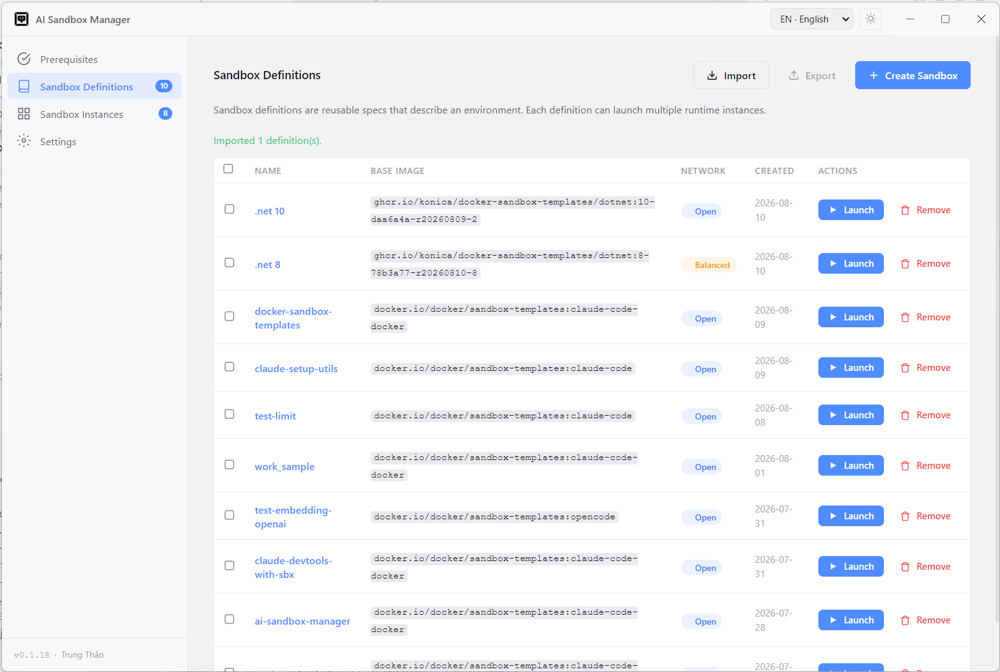

A local control-plane desktop app (Electron) for running AI coding agents —
Claude Code by default — inside isolated [Docker
Sandboxes](https://docs.docker.com/). It wraps Docker's `sbx` CLI so you can
create, launch, and manage sandboxes from a GUI instead of hand-writing `sbx`
commands in a terminal.

## Key concepts

- **Sandbox Definition** — a reusable spec describing an environment (base
  image, workspace, network policy, credentials, ports). One definition can
  launch many instances.
- **Sandbox Instance** — a running or stopped isolated Docker Sandbox created
  from a definition.
- **Agent** — the AI coding agent running inside the sandbox (default: Claude
  Code).
- **Network policy tier** — Open / Balanced / Locked Down egress presets for
  a sandbox, plus an optional domain allowlist.
- **Credentials / Global secrets** — API keys and tokens are injected by a
  host-side proxy at runtime; secrets never enter the sandbox itself.

## Prerequisites

On startup the app runs a **System Prerequisites** check. The three CLI/auth
checks block usage; disk space and OS keychain are warnings you can continue
past.

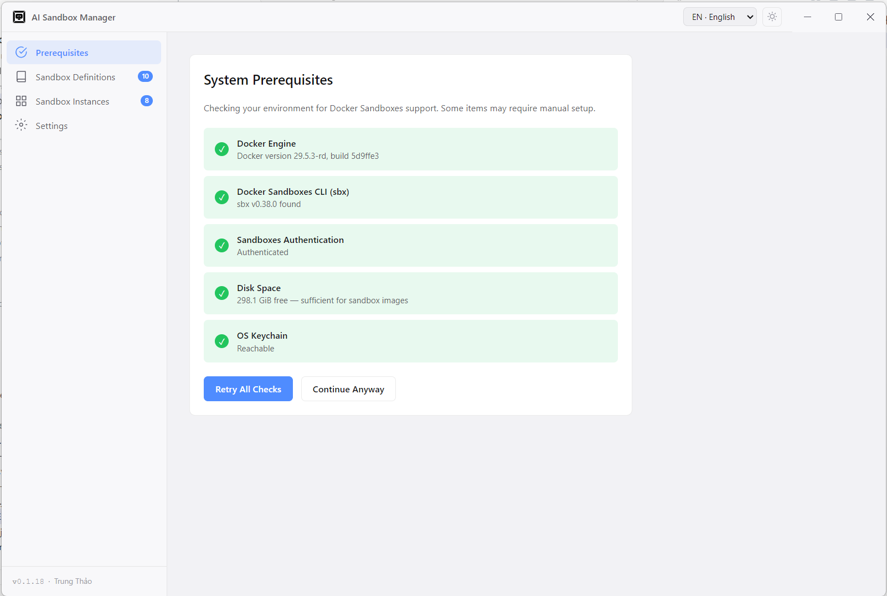

| Requirement | Why | Blocking? |
|---|---|---|
| **Docker Engine** | Runs the sandbox containers | Yes |
| **Docker Sandboxes CLI** (`sbx`) | Control plane for sandboxes | Yes |
| **Sandboxes Authentication** | `sbx login` must be authenticated | Yes |
| Free disk space (≥ 2 GiB) | Room for sandbox images | Warning |
| OS keychain | Credential storage (encrypted fallback if absent) | Warning |
| **Node.js** `>=26.0.0 <27.0.0` | Needed to install/build/run the app from source (see `engines` in `package.json`) | Yes, to run the app at all |

Verify your environment:

```bash
node --version      # v26.x
docker --version
sbx --version
sbx login            # if not already authenticated
```

## Install & run

```bash
# Install dependencies
npm install

# Development (dev server + Electron window, hot reload)
npm run dev
```

> **Native module note:** `better-sqlite3` must be compiled against
> Electron's Node ABI. `npm run dev` and `npm test` normally handle this
> automatically (via `predev`/`pretest` hooks), but if you hit a
> `NODE_MODULE_VERSION` mismatch at launch, run `npm run rebuild`.

The app opens on the **Prerequisites** gate first. Once the blocking checks
(Docker, `sbx`, authentication) pass, it lands on **Sandbox Definitions**.

## Usage guide

### 1. Check prerequisites

The System Prerequisites screen shows each check's status. Use **Retry All
Checks** after fixing an issue, or **Continue Anyway** to proceed past
non-blocking warnings.

### 2. Create a Sandbox Definition

From **Sandbox Definitions**, click **Create Sandbox** to open the 7-step
wizard.

**Step 1 — Workspace**
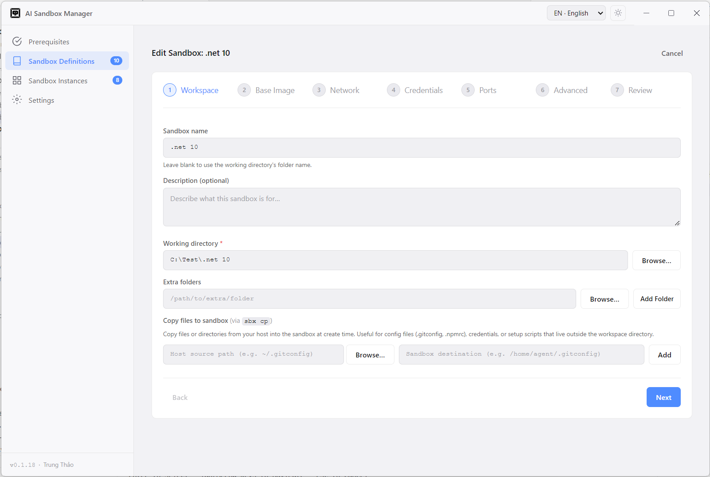
Name and describe the sandbox, choose the required working directory, add
extra read-only/read-write folders, and optionally copy files from the host
into the sandbox at create time.

**Step 2 — Base Image**
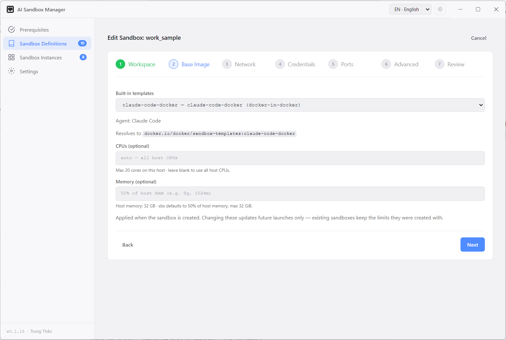
Pick a built-in template or a custom registry image reference, then set
optional CPUs and Memory — the form hints against your host's detected
capacity.

**Step 3 — Network**
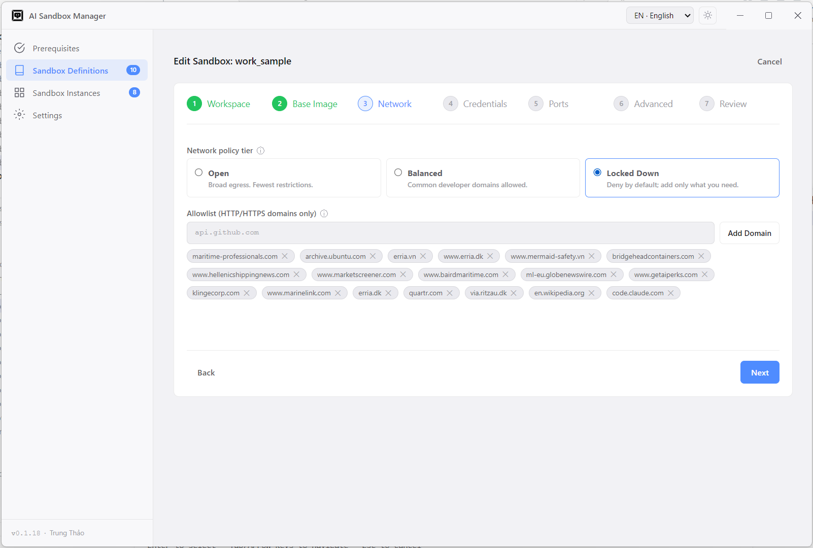
Choose the **network policy tier** — Open, Balanced, or Locked Down — and
optionally add extra HTTP/HTTPS domains to the allowlist (wildcards
supported).

**Step 4 — Credentials**
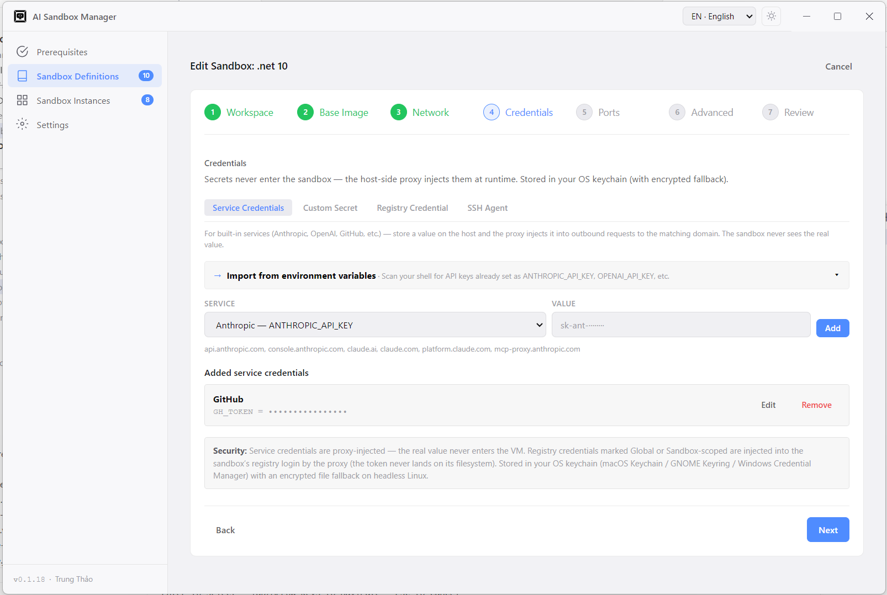
Add credentials under the Service, Custom, Registry, or SSH Agent tabs,
optionally importing values already present in your shell environment.
Scope each credential to this sandbox or make it global.

**Step 5 — Ports**
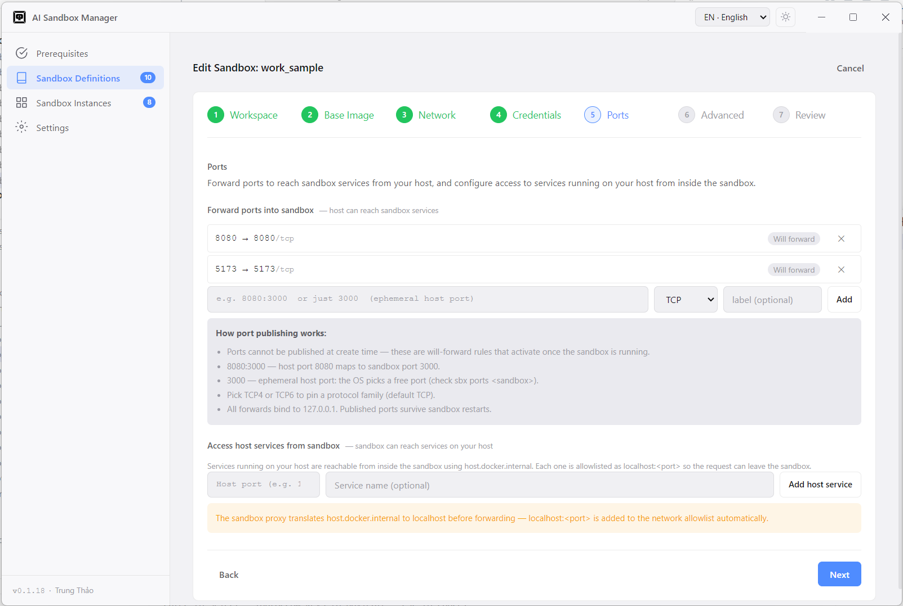
Configure host→sandbox port-forward rules, and allowlist host services the
sandbox can reach via `host.docker.internal`.

**Step 6 — Advanced**
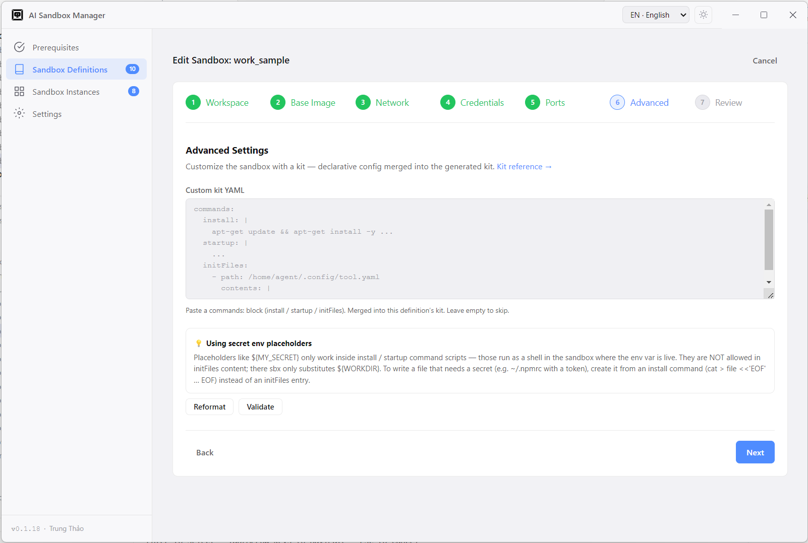
Optionally paste custom kit YAML (`install` / `startup` / `initFiles`
commands) merged into the generated kit, with **Reformat** and **Validate**
actions.

**Step 7 — Review**
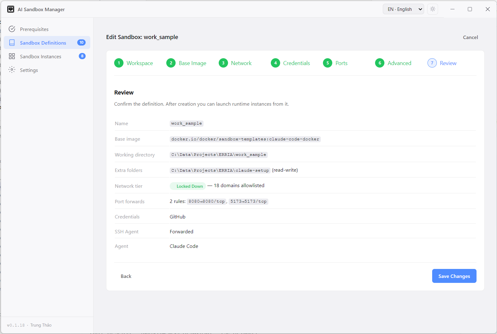
A read-only summary of the definition. Click **Create Sandbox** to save it.

### 3. Launch an Instance

From a definition row in **Sandbox Definitions**, click **Launch**. The
Launch dialog lets you set an optional session name and tags, and choose
**Open with: Terminal or VS Code** (VS Code is disabled if the `code` CLI
isn't found). A unique sandbox name is generated automatically.

### 4. Manage an Instance

Open an instance from **Sandbox Instances** (click its name) to reach the
Instance Detail view, organized into tabs:

**Terminals**
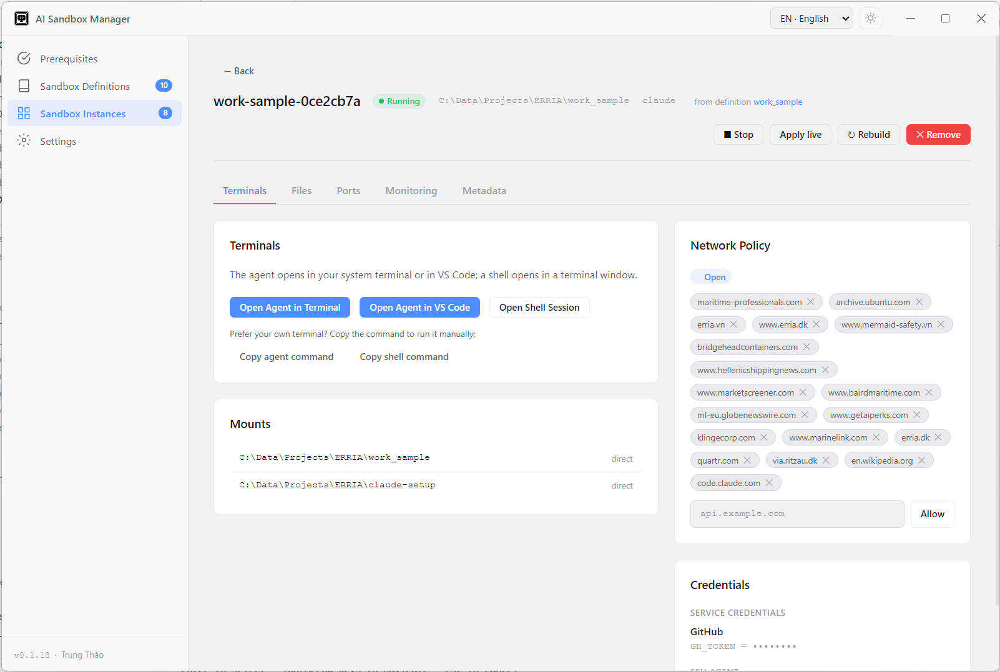
Open the agent in your Terminal or VS Code, open a plain Shell session, or
copy the exact `sbx` command to run it yourself.

**Ports**
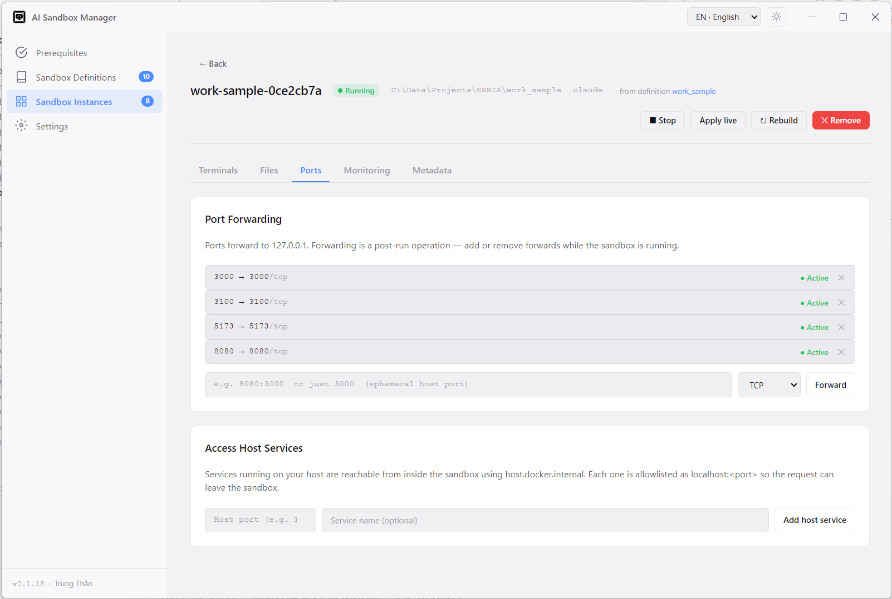
Manage live port forwards and host services reachable from the running
sandbox.

**Files**
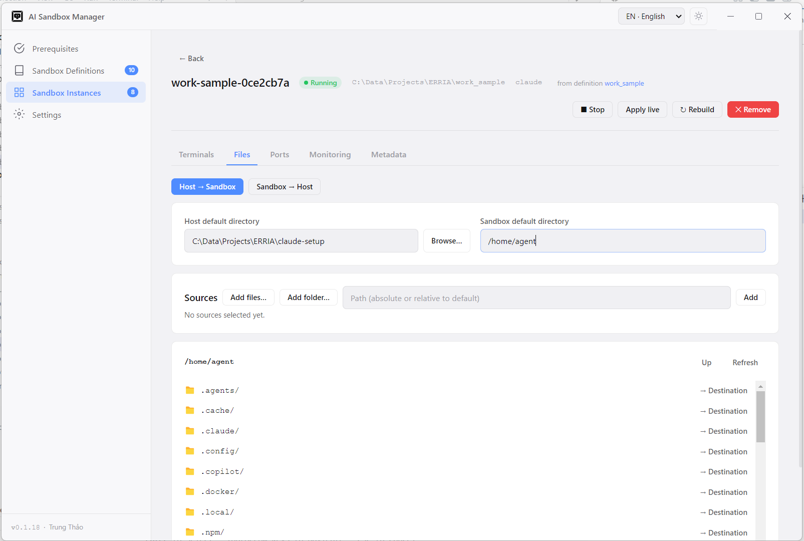
Copy files or folders between the host and the running sandbox in either
direction.

**Monitoring**
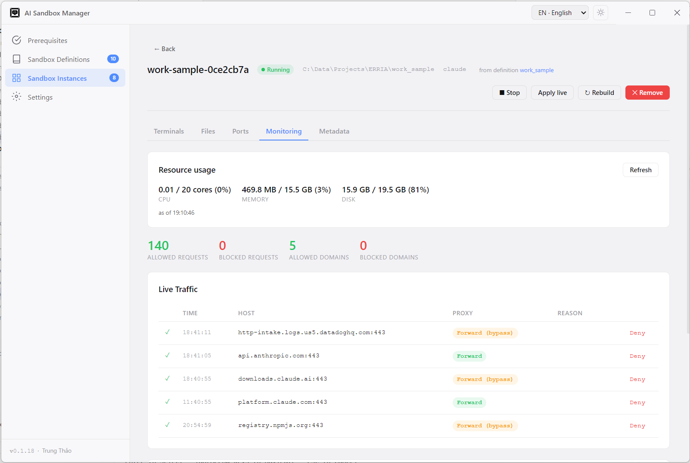
A live traffic log of outbound requests with per-host **Allow**/**Deny**
controls, plus on-demand CPU, Memory, and Disk usage.

Header actions on the detail view: **Apply live** (push credential changes
to the running sandbox without a rebuild), **Rebuild** (recreate the
instance from its definition), and **Remove**.

### 5. Settings

Set the default network tier used to pre-fill new definitions, manage
**Global secrets** (reusable API keys stored in your OS keychain and applied
whenever a sandbox is created), and sign in to Claude Code once under
Accounts.

## Scripts

| Command | Description |
|---|---|
| `npm run dev` | Launch the app in development mode (electron-vite) |
| `npm run build` | Build main, preload, and renderer bundles |
| `npm start` | Preview the production build |
| `npm run typecheck` | Type-check with `tsc --noEmit` |
| `npm test` | Run the test suite (Vitest) |
| `npm run test:watch` | Run tests in watch mode |
| `npm run rebuild` | Rebuild `better-sqlite3` for Electron's ABI |

## Project structure & tech stack

Electron 33 + electron-vite, React 18 + TypeScript, `better-sqlite3` for
local metadata, Vitest for tests. The app never runs agents or containers
directly — it shells out to `sbx` and persists its own definition/instance
metadata locally.

For the full process topology, IPC surface, module map, and data model, see
[docs/ARCHITECTURE.md](docs/ARCHITECTURE.md).

## Troubleshooting

- **`NODE_MODULE_VERSION` error on launch** → `npm run rebuild`
- **`spawn .../electron/dist/dist/Electron.app/... ENOENT`** → the Electron
  install is corrupted (usually a bad `path.txt`). Reinstall cleanly:
  `rm -rf node_modules/electron && npm install electron`
- **Prereq screen blocks on `sbx`** → ensure `sbx` is on your `PATH` and run `sbx login`
- **Prereq screen blocks on Docker** → start Docker Desktop
