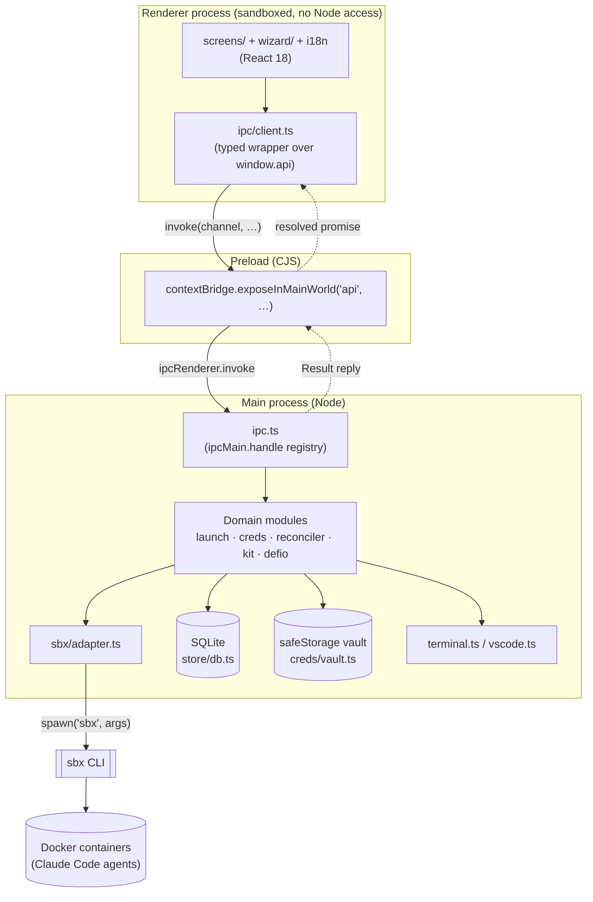
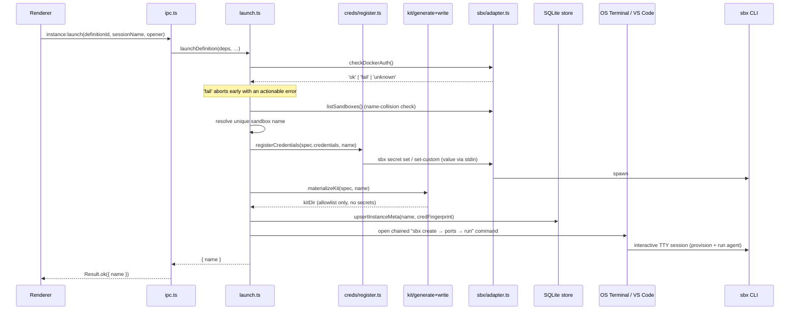
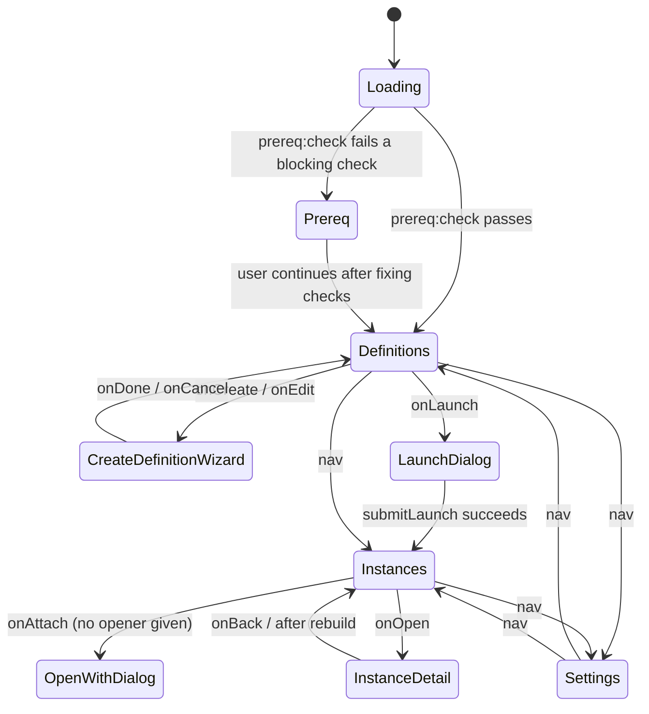
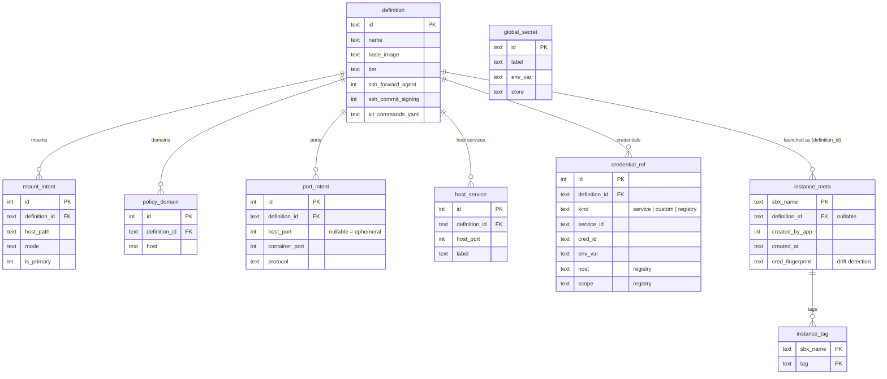

# AI Sandbox Manager — Architecture Overview

**What it is:** An Electron desktop GUI that acts as a *control-plane wrapper* around the `sbx` (Docker Sandboxes) CLI, which runs Claude Code agents inside isolated Docker containers. The app itself never runs agents or containers directly — it generates and shells out to `sbx` commands, and persists its own metadata layer (definitions, launched-instance tracking) in a local SQLite file.

## Process topology (standard Electron 3-process model)

- **Renderer** (`src/renderer`): React 18 + TS. No Node access — `contextIsolation: true`, `nodeIntegration: false`.
- **Preload** (`src/preload/index.ts`): the only bridge. Exposes a flat, fully-typed `api` object via `contextBridge`, one method per IPC channel (`prereqCheck`, `instanceLaunch`, `secretSetGlobal`, …). Renderer imports `Api` as a type, never touches `ipcRenderer` directly.
- **Main** (`src/main`): owns everything with real system access — spawning `sbx`, the SQLite store, the OS keychain vault, opening terminals/VS Code.
- **Shared** (`src/shared`): types and pure helpers importable from both processes (`@shared` alias), the single source of truth for the domain model.

## Main-process module map

| Module | Responsibility |
|---|---|
| `index.ts` | App bootstrap: PATH repair (GUI apps miss login-shell PATH on macOS), opens the SQLite store, builds the `sbx` adapter/logger/vault/creds, wires IPC, creates the `BrowserWindow`. |
| `ipc.ts` | Single registry of ~35 IPC handlers (`buildHandlers`/`registerIpc`), each wrapped in a `Result<T>` (`{ok:true,data}` / `{ok:false,error}`) so failures never throw across the IPC boundary. |
| `sbx/adapter.ts` | The actual CLI wrapper — every `sbx` subcommand (`ls`, `create`, `policy allow/rm`, `ports`, `secret set/rm`, `diagnose`, `kit validate`) goes through `runSbx`, which spawns the binary and classifies non-zero exits into typed `SbxError`s. `sbx/parse.ts`, `policy-log.ts`, `diagnose.ts`, `translate.ts` handle output parsing and args-building. |
| `store/db.ts` | `better-sqlite3` metadata store — **not** the source of truth for running containers, just the app's own bookkeeping: `definition` (+ child tables `mount_intent`, `policy_domain`, `port_intent`, `host_service`, `credential_ref`) and `instance_meta` (+ child table `instance_tag` keyed by `sbx_name`, replaced on write, cascade-deleted with `instance_meta`). Hand-rolled forward-only migrations gated on `PRAGMA table_info` checks, versioned via `user_version`. |
| `reconciler.ts` | Merges live `sbx ls --json` output with `instance_meta`: GCs stale metadata (with a 10-min provisioning grace window), attaches definition name/tier and per-instance `tags` to each live instance, and flags **credential drift** (a running instance's baked-in secrets fingerprint no longer matches its definition → needs rebuild). |
| `launch.ts` | Orchestrates a launch: preflights Docker auth via `checkDockerAuth`, resolves a unique sandbox name (composed from definition slug + tags, with a hash suffix), registers scoped credentials *before* the sandbox exists (so `sbx create` picks them up as env vars with no secret ever hitting a terminal command line), materializes the network-allowlist kit, builds one chained `create → ports → run` command and opens it in a **real terminal or VS Code** (a TTY is required for provisioning + the interactive agent session). Fixed host-port forwards are skipped on the 2nd+ instance of a definition (ephemeral ports are always kept). |
| `creds/` | `vault.ts` (Electron `safeStorage`-backed encrypted local vault), `manager.ts` (staged values + global secrets, orchestrates `sbx secret set/set-custom/set-registry`), `env-scan.ts` (detects service credentials already in the user's shell env), `register.ts` (fingerprinting + sandbox-scoped registration, shared by launch and re-attach). |
| `auth/manager.ts` | Claude Code's own OAuth/API-key status, read via `sbx diagnose`/`sbx secret ls -g` — separate from the app's own credential vault. |
| `kit/` | Generates and writes the per-launch "kit" — a `spec.yaml` mixin declaring the network allowlist (and optional custom command overrides) that `sbx create` consumes; carries no secrets, lives in `<workspace>/.sandbox/kit` (gitignored). |
| `defio/bundle.ts` | Definition import/export as `.sbx.json` bundles (native save/open dialogs in `index.ts`). |
| `detail/persist.ts` | Live edits made from the Instance Detail screen (port publish/unpublish, host-service allow, domain allow/deny) are applied to the running sandbox via the adapter *and* best-effort dual-written back into the definition, so future launches keep the change. |
| `prereq.ts` / `probes.ts` | Startup gate: Node/Docker/`sbx`/`sbx login`/disk/keychain checks, rendered by the renderer's Prereq screen before anything else is usable. |
| `terminal.ts` / `vscode.ts` | Spawns the user's native terminal or `code` CLI with the constructed `sbx` command. |
| `log.ts` | File logger (`sandbox-manager.log` in userData) recording every `sbx` invocation and app-level action for troubleshooting. |

### Launch flow

The security-critical path — credentials are registered against the not-yet-created sandbox name *before* any terminal opens, so no secret ever appears on a command line:

## Renderer structure

- `App.tsx` — root component and de facto router: runs the prereq gate on mount, then flat `screen` state (`prereq | definitions | instances | settings`) with no external router.
- `screens/` — `Prereq`, `Definitions`, `Instances`, `InstanceDetail` (with `detail/` tabs: Monitoring, Ports, Terminals), `GlobalSecrets`, `AccountsSection`, `Settings`.
- `wizard/` — multi-step `CreateDefinition` flow (+ `CredentialsStep`, `PortsStep`, `draft.ts` for in-progress wizard state) that produces a `DefinitionSpec`.
- `components/` — `AppShell` (nav chrome), `ConfirmModal`, `LaunchDialog`, `OpenWithDialog`, `badges`.
- `ipc/client.ts` — thin typed wrapper re-exporting `window.api`.
- `i18n/` — `en`/`de` dictionaries behind a `useT()` hook.
- `theme/` — CSS custom-property design tokens (`app.css`/`overrides.css`), no CSS-in-JS.
- Renderer polls `instances:list` every 4s while the Instances screen is active (no push/event channel from main → renderer).

### Screen flow

`App.tsx` holds one `screen` state variable and no external router; the prereq gate runs once on mount and decides the entry screen.

## Domain model (`src/shared/types.ts`)

- **Definition** — the reusable blueprint (name, base image, tier, SSH options, kit commands) — persisted in SQLite.
- **DefinitionSpec** — a Definition plus its children: `mounts` (direct/clone), `domains`, `ports`, `hostServices`, `credentials` (service/custom/registry kinds).
- **InstanceMeta** — app-side record of a launched sandbox (name, linked definition, credential fingerprint).
- **InstanceView** — what the UI renders: live `sbx ls` data merged with the above via `reconcile()`.
- Three access tiers (`open | balanced | locked`) drive the network-policy allowlist.

### SQLite schema

`definition` is the blueprint; its five child tables are fully replaced (delete + reinsert) on every `def:update`. `instance_meta` is separate — it tracks sandboxes the app has launched, keyed by the live `sbx` name rather than the definition.

## Security-relevant design points

- Secrets are staged/read only in the main process; they reach `sbx` via **stdin** or scoped `secret set-custom`/`set-registry` calls, never as renderer-visible IPC payloads or shell-history-exposed argv (registry tokens use `--password-stdin`).
- The renderer has zero Node/filesystem access — every privileged operation is an explicit, narrowly-typed IPC call.
- The generated network-allowlist "kit" is intentionally secret-free; it only shapes what a sandbox is allowed to reach.

## Build & tooling

- **electron-vite** builds three independent bundles (main/preload/renderer) from one config; preload is forced to CJS (`.cjs`) since the renderer runs sandboxed.
- `better-sqlite3` is a native module rebuilt against Electron's ABI (`scripts/ensure-abi.mjs`, `electron-rebuild`) — a recurring source of "Electron uninstall"-class dev-env issues.
- **Vitest** test suite mirrors `src/` 1:1 (`tests/main`, `tests/renderer`, `tests/shared`), using `jsdom` for renderer component tests.
