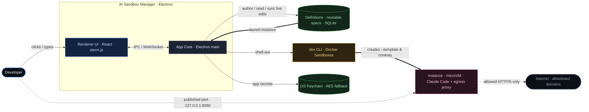
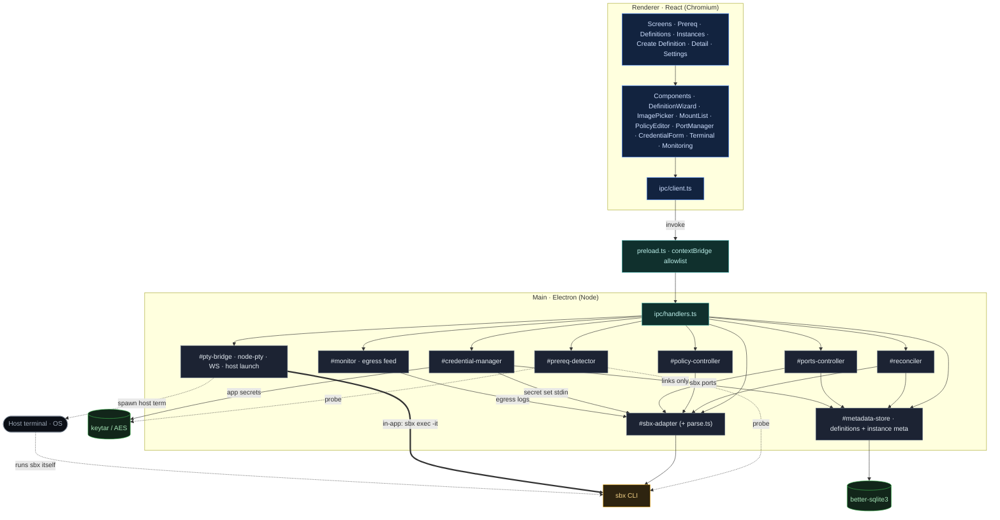
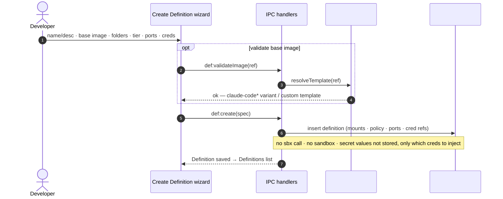
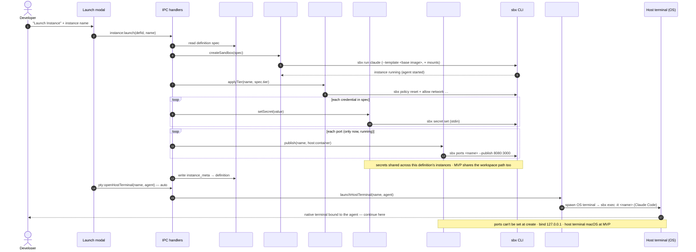
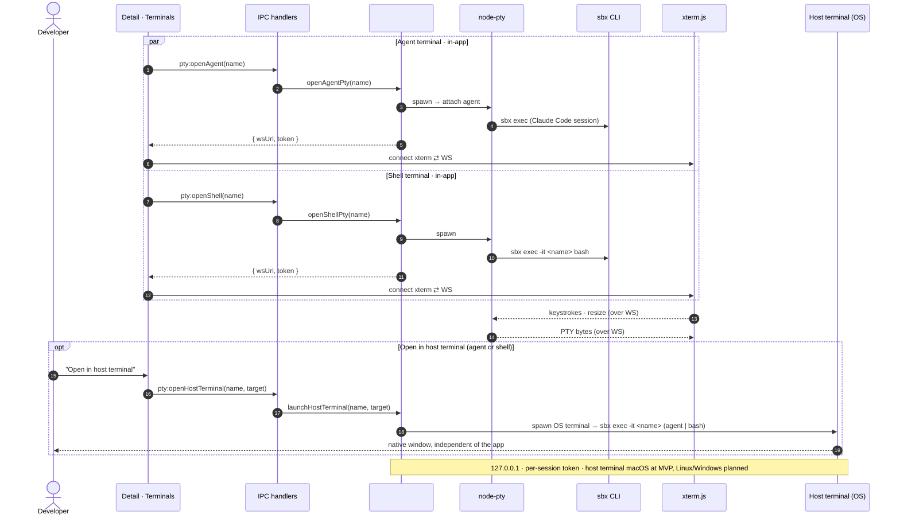
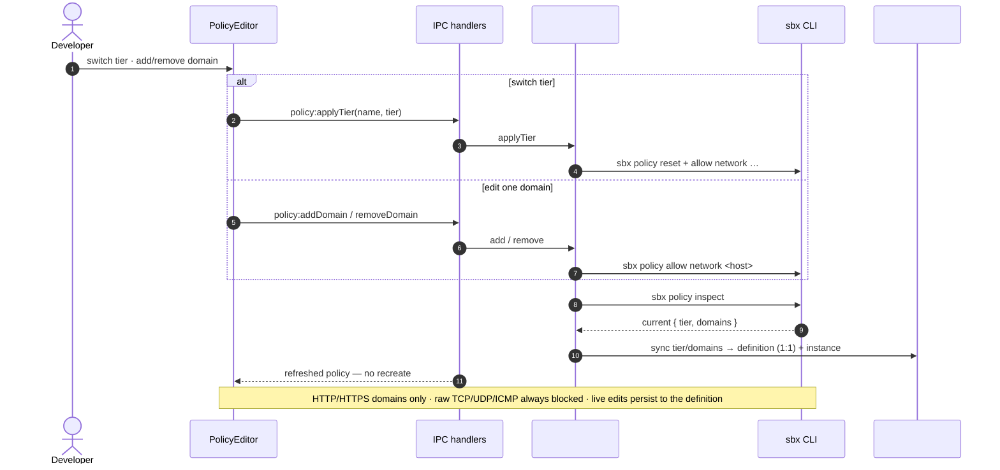
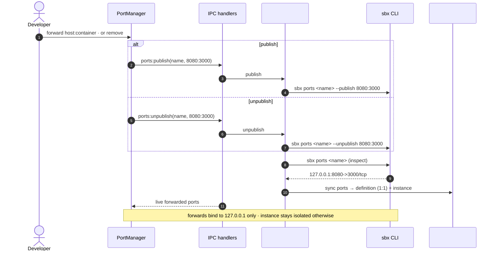
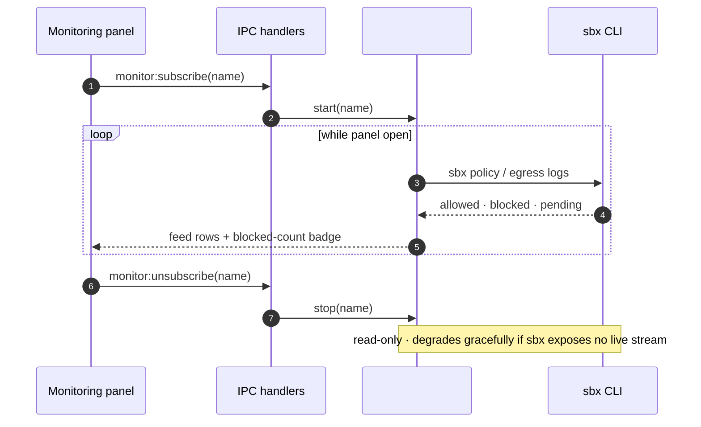
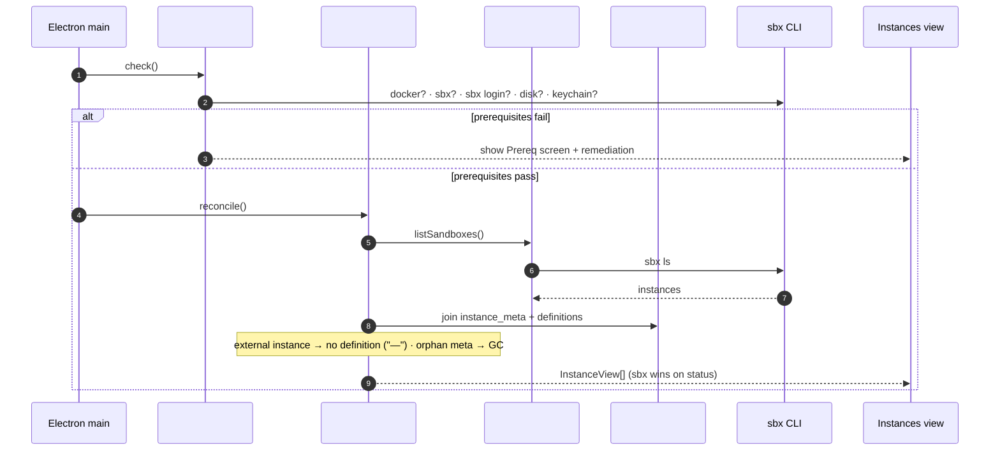

# AI Sandbox Manager — Component & Flow Design

_Date: 2026-07-18 · Status: design (for review)_
_Grounded in: PRD `prd-local-sandbox-manager-for-coding-agents-001` (v3) and the mockup export `brainstorm/mockup/AI Sandbox Manager v3` (Definitions → Instances model; v3 content is identical to the earlier v2)._
_Note: the SpecManager architecture doc `arch-local-sandbox-manager-for-coding-agents-001` (v1) predates this model and has not been reconciled to it — this design doc is the current source for the Definitions→Instances component/flow design._
_Rendered companion (diagrams): Artifact `f680b816-a1f9-4e25-bddd-d2be611a1982`._

## 1. Purpose & scope

A local, single-user **Electron desktop app** that is a control-plane GUI over the Docker Sandboxes CLI (`sbx`). It lets a developer run the Claude Code coding agent inside an isolated Docker Sandbox against a chosen workspace — without ever typing an `sbx` command. The app builds **no** isolation itself; all isolation, egress enforcement, and credential injection are delegated to `sbx`. The app composes `sbx` invocations, streams terminals into the UI, launches native host terminals, and keeps a thin local metadata store reconciled against `sbx` (the source of truth for sandbox existence and state).

This document consolidates the **main components** and their **flowcharts**. It does not restate the full PRD/architecture; it makes the structure and behavior visual and records the decisions taken during the design brainstorm.

### Confirmed tech stack

| Layer | Choice |
|---|---|
| App shell | Electron (Node main + bundled Chromium renderer) |
| Renderer UI | React + Vite + TypeScript |
| Terminals | xterm.js (renderer) ⇄ node-pty (main), over a localhost WebSocket |
| Host terminal | pluggable per-OS launcher (macOS at MVP; Linux/Windows planned) |
| sbx integration | CLI shell-out only (`child_process`); no SDK exists |
| App metadata | better-sqlite3 |
| Credential values | delegated to `sbx secret set` (stdin); app never persists values |
| App-held secret material | keytar (OS keychain) + AES-GCM encrypted-file fallback |

## 2. Core model: Definitions → Instances

- **Sandbox Definition** — a reusable spec authored in the app and stored in SQLite: name/description, base image (template), working directory + extra folders (with per-folder mount mode), network tier + allowlist, published-port intents, and credentials. Nothing runs until a definition is launched.
- **Instance** — a running Docker Sandbox launched from a definition (given an instance name). One instance = one `sbx` sandbox running Claude Code.
- The common case is **1:1** definition-to-instance, so **live edits on a running instance sync back to the parent definition** (see §6).

## 3. Overview

## 4. Components

Six renderer screens, one preload/IPC bridge, eight single-purpose main-process modules. Two hard choke points: only `#sbx-adapter` spawns `sbx`; only `#pty-bridge` owns `node-pty`.

| Module | Responsibility |
|---|---|
| `#prereq-detector` | First-run checks: Docker, `sbx` on PATH, `sbx login`, disk headroom, OS-keychain reachability. |
| `#sbx-adapter` | The only `sbx` spawn site. JSON-first, text-fallback parsing; normalized `SbxError` union. |
| `#reconciler` | Joins `sbx ls` (instances) with local `instance_meta` + `definition`; `sbx` wins on status. |
| `#policy-controller` | Tier ↔ allowlist translation; `sbx policy allow/reset/inspect`. |
| `#ports-controller` | `sbx ports --publish/--unpublish/inspect` (post-run only; binds `127.0.0.1`). |
| `#credential-manager` | Values → `sbx secret set` (stdin); app metadata + keychain/AES fallback. No value in SQLite. |
| `#pty-bridge` | node-pty ⇄ localhost WebSocket for in-app terminals; pluggable per-OS host-terminal launcher. |
| `#monitor` | Reads `sbx` egress/policy output for the Monitoring feed (depth TBD). |
| `#metadata-store` | better-sqlite3: definitions + instance metadata; reconciliation joins. |

## 5. Terminal model

Three terminal surfaces per running instance:

1. **In-app agent terminal** — attaches to the running Claude Code process (xterm.js ⇄ node-pty over localhost WS).
2. **In-app shell terminal** — a fresh `bash` via `sbx exec -it <name> bash`, independent of the agent.
3. **Native host terminal** (escape hatch) — launches the OS's own terminal app bound to the instance (agent or shell target), runs independently, survives closing the app. macOS at MVP; Linux/Windows planned.

On **launch of an instance**, the app auto-opens a **native host terminal connected to the Claude Code agent** so the developer continues work there immediately.

## 6. Flows

### 6.1 Create definition (persist a spec — nothing runs)

**Base image:** applied at launch via `--template`. Must be a `claude-code*` variant (default `docker/sandbox-templates:claude-code-docker`) or a custom template derived from one (ImagePicker offers built-ins + a custom `docker.io/org/img:tag` field).

### 6.2 Launch instance (the sbx-heavy flow → straight into the agent)

### 6.3 Attach terminals (two in-app + host escape hatch)

### 6.4 Live policy edit (syncs to the definition)

### 6.5 Manage published ports (post-run; syncs to the definition)

### 6.6 Monitoring feed

### 6.7 Launch reconciliation

## 7. Resolved decisions (MVP)

1. **Live edits sync to the definition.** The common case is 1:1 definition-to-instance, so tier/domain/port changes on a running instance persist back to the parent definition (not instance-scoped overrides).
2. **Shared workspace for MVP.** Instances of a definition share the workspace path. Per-instance isolation via **git worktrees** is the planned post-MVP model — not built at MVP.
3. **Credentials shared across a definition's instances** (not injected per-instance in isolation).
4. **Monitoring depth — deferred (TBD).** The allowed/blocked/pending feed exists in the UI; exactly how much `sbx` exposes and the polling-vs-streaming model are decided later.

## 8. Grounded `sbx` constraints (must hold in the UI)

- microVM isolation, separate kernel/daemon — the app offers no isolation knob beyond what `sbx` exposes.
- Egress deny-by-default; **HTTP/HTTPS to allowlisted domains only**; raw TCP/UDP/ICMP always blocked.
- Mounts: **direct** (read-write passthrough) or **clone** (read-only) — the only two modes; warn on direct-mode implicit-execution files.
- Credentials injected via `sbx`'s host-side proxy; raw values never enter the VM; registered via `sbx secret set` (stdin, OS-keychain-backed).
- **Ports cannot be published at create time** — no `--publish` on `sbx run`/`sbx create`; forward post-run via `sbx ports --publish` (binds `127.0.0.1`).
- Base image via `--template docker.io/...` (`sbx` won't auto-resolve `docker.io`).
- `sbx stop` preserves state; `sbx rm` is irreversible (deletes VM+images+packages; host files untouched) — distinct, differently-weighted UI actions.
- No auto-restart on app launch; restart is a manual action.

## 9. Deferred / open (for the plan)

- Which `sbx` subcommands emit machine-readable/`--json` output (sizes the text-parser fallback).
- Exact command to attach to the **running** Claude Code process (vs. launching a new one).
- Monitoring feed depth + polling-vs-streaming model (decision deferred).
- Concrete tier→allowlist domain sets and detecting/pruning `sbx` default wildcards.
- Claude Code in-sandbox `/login` OAuth handshake end-to-end vs. `sbx secret set`.
- Native-module packaging: `better-sqlite3` + `node-pty` rebuilt against Electron's ABI.
- Post-MVP: git-worktree-per-instance workspace isolation.
